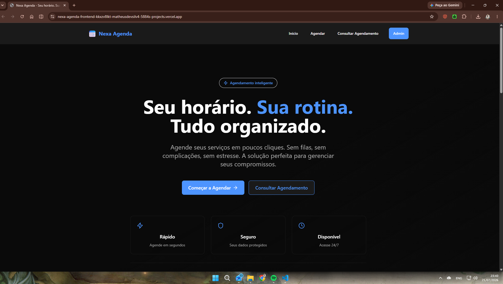
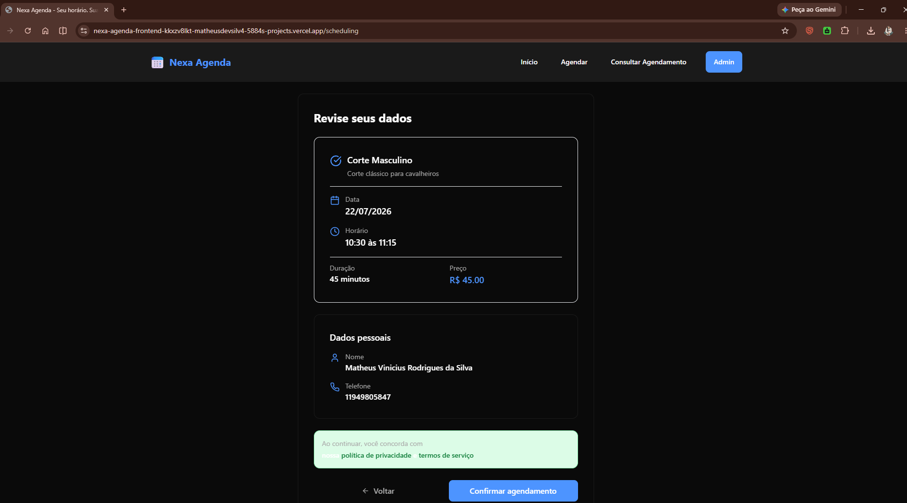
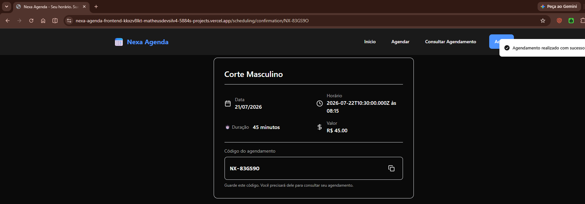
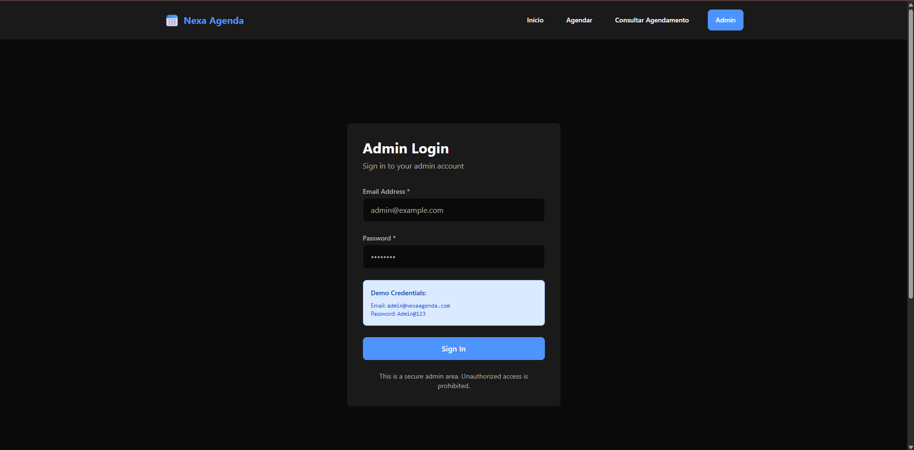
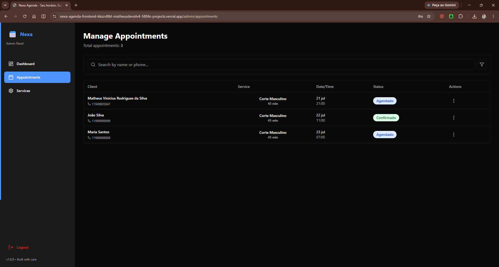

<div align="center">

# 🗓️ Nexa Agenda

### Modern Appointment Scheduling Platform

Sistema Full Stack de agendamento online desenvolvido para oferecer uma experiência intuitiva aos clientes e uma área administrativa completa para gerenciamento de serviços e agendamentos.

Desenvolvido com **React**, **TypeScript**, **Node.js**, **Express**, **Prisma ORM** e **PostgreSQL**, aplicando boas práticas de arquitetura, autenticação JWT, validação de dados e integração entre frontend e backend.

<br>


</div>

---

# 🚀 Live Application

| Resource | Link |
|----------|------|
| 🌐 Frontend | https://nexa-agenda-frontend.vercel.app |
| ⚙️ Backend API | https://nexa-agenda-backend-production.up.railway.app |
| 📦 Backend Repository | https://github.com/MaximillionDev1/nexa-agenda-backend |

---

# 🎬 Demo

<p align="center">


</p>

> Demonstração completa do fluxo de agendamento, autenticação administrativa e gerenciamento de serviços.

---

# 🏗️ System Architecture

```text
                         User

                          │
                          ▼

                  React + TypeScript
                     (Vite + SPA)

                          │

             React Query + Axios API

                          │
                          ▼

                Express REST API

                          │

                 Authentication JWT

                          │

                    Prisma ORM

                          │
                          ▼

                     PostgreSQL
```

O frontend é responsável pela experiência do usuário, gerenciamento de estado remoto, validações de interface e comunicação com a API REST. Toda a lógica crítica de negócio permanece centralizada no backend, garantindo maior segurança e consistência dos dados.

---

# ✨ Highlights

- ✅ Fluxo completo de agendamento em múltiplas etapas
- ✅ Consulta pública de agendamentos utilizando código e telefone
- ✅ Área administrativa protegida por autenticação JWT
- ✅ Dashboard operacional com indicadores em tempo real
- ✅ Gerenciamento completo de serviços
- ✅ Gerenciamento completo de agendamentos
- ✅ Validação de formulários utilizando React Hook Form + Zod
- ✅ Gerenciamento inteligente de cache com TanStack React Query
- ✅ Interface totalmente responsiva
- ✅ Arquitetura baseada em componentes reutilizáveis
- ✅ Comunicação desacoplada via API REST
- ✅ Deploy em produção utilizando Vercel e Railway

---

# 🎯 Project Overview

O **Nexa Agenda** é uma aplicação Full Stack desenvolvida para simplificar o processo de agendamento de serviços.

A aplicação foi projetada para oferecer duas experiências distintas:

- **Área Pública**, onde clientes podem consultar serviços disponíveis, escolher horários livres, realizar agendamentos e consultar reservas existentes.

- **Área Administrativa**, destinada ao gerenciamento operacional do sistema, permitindo controlar serviços, acompanhar agendamentos e visualizar indicadores do negócio.

Durante o desenvolvimento foram aplicados princípios de separação de responsabilidades, componentização, validação de dados, autenticação baseada em JWT e integração eficiente entre frontend e backend.

O projeto também prioriza escalabilidade, manutenção e organização do código, utilizando uma arquitetura moderna baseada em React para a interface e Express + Prisma para a camada de serviços.

---

# 📌 Principais Tecnologias

| Categoria | Tecnologias |
|------------|-------------|
| Frontend | React 18, TypeScript, Vite |
| Estilização | Tailwind CSS |
| Estado Remoto | TanStack React Query |
| Formulários | React Hook Form |
| Validação | Zod |
| Comunicação | Axios |
| Backend | Express + TypeScript |
| ORM | Prisma |
| Banco de Dados | PostgreSQL |
| Autenticação | JWT |
| Deploy | Vercel + Railway |
# 📖 About the Project

## Overview

**Nexa Agenda** é uma plataforma Full Stack de agendamento online desenvolvida para digitalizar o processo de marcação e gerenciamento de serviços.

A aplicação permite que clientes realizem agendamentos de forma rápida e intuitiva, enquanto disponibiliza uma área administrativa segura para gerenciamento completo da operação.

O projeto foi desenvolvido aplicando conceitos modernos de desenvolvimento Full Stack, arquitetura em camadas, autenticação baseada em JWT, validação de dados e integração entre frontend e backend por meio de uma API REST.

Mais do que um sistema funcional, o Nexa Agenda demonstra a construção de uma aplicação escalável, organizada e preparada para evoluções futuras.

---

# 🎯 Problem Statement

Em muitos pequenos negócios, o processo de agendamento ainda acontece através de mensagens em aplicativos de conversa ou ligações telefônicas.

Esse modelo costuma gerar diversos problemas, como:

- Conflito entre horários
- Dificuldade para localizar agendamentos
- Controle manual dos serviços
- Baixa organização operacional
- Dependência do atendimento humano
- Pouca visibilidade sobre a agenda disponível

O Nexa Agenda foi criado para solucionar esses desafios oferecendo uma experiência digital simples para o cliente e ferramentas administrativas para o negócio.

---

# 💡 Proposed Solution

A aplicação centraliza todo o processo de agendamento em uma única plataforma.

O cliente consegue:

- consultar os serviços disponíveis;
- escolher uma data;
- visualizar horários livres;
- realizar um novo agendamento;
- consultar reservas existentes utilizando um código público.

Enquanto isso, a administração possui controle completo sobre:

- serviços cadastrados;
- disponibilidade da agenda;
- acompanhamento dos agendamentos;
- indicadores operacionais.

Toda a lógica crítica permanece protegida no backend, garantindo segurança e consistência dos dados.

---

# 👥 Target Audience

O projeto foi pensado para negócios que trabalham com atendimento mediante agendamento, como por exemplo:

- Barbearias
- Salões de beleza
- Clínicas
- Consultórios
- Estúdios
- Prestadores de serviço
- Profissionais autônomos

Sua arquitetura permite adaptações para diferentes segmentos sem grandes alterações estruturais.

---

# ⭐ Key Features

## Área Pública

Clientes podem:

- visualizar os serviços disponíveis;
- selecionar uma data de atendimento;
- consultar horários disponíveis em tempo real;
- preencher seus dados;
- confirmar um agendamento;
- consultar um agendamento existente utilizando código e telefone.

---

## Área Administrativa

Administradores autenticados podem:

- realizar login seguro;
- visualizar indicadores da operação;
- gerenciar serviços;
- ativar ou desativar serviços;
- acompanhar todos os agendamentos;
- alterar status dos atendimentos;
- cancelar agendamentos;
- excluir registros quando necessário.

---

# 🔄 User Journey

O fluxo completo da aplicação foi desenvolvido para minimizar a quantidade de etapas necessárias até a confirmação do agendamento.

```text
Cliente

    │

    ▼

Página Inicial

    │

    ▼

Escolha do Serviço

    │

    ▼

Seleção da Data

    │

    ▼

Consulta da Disponibilidade

    │

    ▼

Preenchimento dos Dados

    │

    ▼

Confirmação

    │

    ▼

Código Público de Consulta
```

Esse fluxo foi dividido em etapas para reduzir a carga cognitiva do usuário e tornar o processo mais intuitivo.

---

# 🔐 Administrative Workflow

```text
Administrador

      │

      ▼

Login JWT

      │

      ▼

Dashboard

      │

      ├──────────────► Serviços

      │                     │

      │                     ▼

      │            Criar / Editar / Ativar

      │

      └──────────────► Agendamentos

                            │

                            ▼

              Confirmar

              Concluir

              Cancelar

              Excluir
```

A separação entre área pública e administrativa garante que apenas usuários autenticados tenham acesso às funcionalidades de gerenciamento.

---

# 🎯 Project Goals

Durante o desenvolvimento deste projeto, alguns objetivos técnicos foram definidos:

- Construir uma SPA moderna utilizando React e TypeScript.
- Implementar uma comunicação desacoplada entre frontend e backend.
- Aplicar autenticação baseada em JWT.
- Desenvolver componentes reutilizáveis.
- Utilizar gerenciamento inteligente de cache com React Query.
- Implementar validações de formulário utilizando React Hook Form e Zod.
- Criar uma interface responsiva.
- Aplicar boas práticas de organização e componentização.
- Demonstrar integração completa com uma API REST.
- Desenvolver um projeto próximo de um cenário real de produção.

---

# 🚀 Main Differentials

O Nexa Agenda foi desenvolvido priorizando não apenas a implementação de funcionalidades, mas também aspectos importantes de qualidade de software.

Entre seus principais diferenciais estão:

- Arquitetura organizada e de fácil manutenção.
- Separação clara entre responsabilidades.
- Componentização reutilizável.
- Interface responsiva.
- Comunicação desacoplada via API.
- Gerenciamento de estado remoto utilizando React Query.
- Validação robusta dos dados.
- Experiência de usuário simples e intuitiva.
- Código preparado para evolução futura.
# 🖼️ User Interface

A interface do **Nexa Agenda** foi desenvolvida priorizando simplicidade, clareza e responsividade, proporcionando uma experiência intuitiva tanto para clientes quanto para administradores.

Cada tela possui uma responsabilidade bem definida, reduzindo a quantidade de informações exibidas simultaneamente e guiando o usuário naturalmente durante o fluxo de utilização.

---

# 🎬 Application Demo

A demonstração abaixo apresenta o fluxo completo da aplicação, desde o acesso à página inicial até o gerenciamento administrativo.

<p align="center">


</p>

> A demonstração inclui o fluxo de agendamento, consulta pública e funcionalidades disponíveis para administradores autenticados.

---

# 📸 Interface Overview

## 🏠 Home

<p align="center">



</p>

A página inicial apresenta o sistema ao usuário e serve como ponto de entrada para os principais fluxos da aplicação.

### Destaques

- Interface limpa e objetiva.
- Navegação intuitiva.
- Acesso rápido ao agendamento.
- Consulta pública de reservas.

---

## 📅 Appointment Scheduling

<p align="center">



</p>

O processo de agendamento foi dividido em múltiplas etapas para tornar o preenchimento mais organizado e reduzir erros durante a interação.

Durante esse fluxo o usuário pode:

- escolher um serviço;
- selecionar uma data;
- visualizar horários disponíveis;
- preencher seus dados;
- revisar as informações;
- confirmar o agendamento.

Esse modelo melhora significativamente a experiência do usuário quando comparado a formulários longos em uma única tela.

---

## ✅ Appointment Confirmation

<p align="center">



</p>

Após a criação do agendamento, o sistema apresenta uma tela de confirmação contendo as principais informações da reserva.

Além da confirmação visual, é gerado um código público utilizado posteriormente para consulta do agendamento.

Essa abordagem elimina a necessidade de criação de contas para clientes ocasionais.

---

## 🔐 Administrative Login

<p align="center">



</p>

A área administrativa é protegida por autenticação baseada em JWT.

Somente usuários autenticados podem acessar funcionalidades de gerenciamento.

A tela de login possui validação de campos, feedback visual e integração direta com a API de autenticação.

---

## 📊 Administrative Dashboard

<p align="center">


</p>

O Dashboard centraliza informações relevantes para a operação.

Entre elas:

- indicadores da agenda;
- visão geral dos agendamentos;
- acesso rápido às áreas administrativas.

O objetivo é permitir que o administrador visualize rapidamente o estado atual da operação.

---

## 📋 Appointment Management

<p align="center">



</p>

Nesta tela o administrador possui controle completo sobre os agendamentos realizados.

É possível:

- consultar reservas;
- alterar status;
- cancelar atendimentos;
- excluir registros;
- acompanhar a agenda de forma centralizada.

Essa separação mantém a área operacional organizada e facilita o gerenciamento diário.

---

# 📱 Responsive Design

O Nexa Agenda foi desenvolvido utilizando uma abordagem responsiva, garantindo boa experiência de uso em diferentes tamanhos de tela.

A interface adapta automaticamente:

- espaçamentos;
- tipografia;
- componentes;
- navegação;
- formulários.

Essa estratégia permite que a aplicação seja utilizada tanto em desktops quanto em dispositivos móveis sem perda de usabilidade.

---

# 🎨 User Experience

Durante o desenvolvimento da interface foram adotados alguns princípios de UX para tornar a navegação mais intuitiva.

### ✔ Fluxo Guiado

O usuário realiza uma ação por vez, reduzindo a carga cognitiva.

---

### ✔ Feedback Visual

A interface informa claramente quando operações estão sendo executadas ou concluídas.

---

### ✔ Validação Imediata

Erros de preenchimento são apresentados de forma clara antes do envio dos formulários.

---

### ✔ Navegação Simples

As principais funcionalidades podem ser acessadas em poucos cliques.

---

### ✔ Consistência Visual

Componentes reutilizáveis mantêm o mesmo comportamento em toda a aplicação.

---

# 🎯 Interface Goals

A interface foi construída visando:

- facilidade de uso;
- organização visual;
- acessibilidade;
- responsividade;
- rapidez de navegação;
- experiência consistente;
- integração transparente com a API.
# ⚙️ Features

O Nexa Agenda foi desenvolvido com foco na separação entre a experiência do cliente e as funcionalidades administrativas, garantindo uma navegação intuitiva para usuários finais e uma gestão eficiente para administradores.

---

# 👤 Public Area

A área pública permite que qualquer usuário realize um agendamento sem necessidade de criar uma conta.

## Available Features

### 🏠 Home Page

- Apresentação da aplicação
- Acesso ao fluxo de agendamento
- Consulta de agendamentos existentes

---

### 📅 Appointment Scheduling

Fluxo dividido em múltiplas etapas para tornar a experiência mais simples.

O usuário pode:

- Escolher um serviço
- Selecionar uma data disponível
- Consultar horários livres
- Informar seus dados
- Revisar as informações
- Confirmar o agendamento

---

### ⏰ Real-time Availability

Durante o agendamento a aplicação consulta a API para exibir apenas horários realmente disponíveis.

Essa estratégia evita conflitos antes mesmo do envio do formulário.

---

### 📋 Appointment Confirmation

Após o cadastro o sistema apresenta:

- Serviço escolhido
- Data
- Horário
- Dados do cliente
- Código público do agendamento

Esse código permite futuras consultas sem necessidade de autenticação.

---

### 🔍 Appointment Lookup

Clientes podem consultar seus agendamentos utilizando:

- Código público
- Telefone informado no cadastro

Essa abordagem elimina a necessidade de criação de contas para clientes ocasionais.

---

# 🔐 Administrative Area

A área administrativa é protegida por autenticação baseada em JWT.

Somente usuários autenticados possuem acesso às funcionalidades de gerenciamento.

---

## Authentication

O administrador pode:

- realizar login;
- permanecer autenticado durante a sessão;
- acessar páginas protegidas;
- finalizar sua sessão com logout.

---

## Dashboard

O Dashboard apresenta indicadores operacionais para facilitar o acompanhamento da agenda.

Entre eles:

- resumo operacional;
- visão geral dos agendamentos;
- atalhos para gerenciamento.

---

## Appointment Management

O administrador possui controle completo sobre os agendamentos.

Operações disponíveis:

- visualizar
- pesquisar
- atualizar status
- cancelar
- excluir

---

## Service Management

A aplicação permite administrar todos os serviços oferecidos.

Funcionalidades:

- cadastrar
- editar
- ativar
- desativar
- excluir

Serviços inativos deixam automaticamente de aparecer para novos agendamentos.

---

# 📖 Functional Overview

```text
Cliente

↓

Página Inicial

↓

Novo Agendamento

↓

Escolha do Serviço

↓

Escolha da Data

↓

Consulta de Horários

↓

Dados do Cliente

↓

Confirmação

↓

Código Público
```

---

Administrador

```text
Login

↓

Dashboard

↓

Gerenciar Serviços

↓

Gerenciar Agendamentos

↓

Atualizar Status

↓

Encerrar Sessão
```

---

# 🧠 Business Rules Consumed by the Frontend

Embora as regras de negócio sejam processadas no backend, o frontend foi desenvolvido para consumi-las de forma transparente.

Entre elas:

✔ Apenas horários disponíveis podem ser selecionados.

✔ Serviços desativados não aparecem para novos clientes.

✔ Datas anteriores não podem ser utilizadas.

✔ Horários anteriores são bloqueados automaticamente.

✔ Campos obrigatórios são validados antes do envio.

✔ Apenas administradores autenticados possuem acesso à área administrativa.

✔ Erros retornados pela API são apresentados ao usuário de forma amigável.

---

# 🎯 User Experience

Durante o desenvolvimento foram adotadas algumas decisões para tornar o fluxo mais intuitivo.

## Multi-step Forms

O processo foi dividido em etapas menores.

Benefícios:

- reduz erros
- facilita preenchimento
- melhora usabilidade
- diminui abandono

---

## Immediate Feedback

Sempre que possível a interface informa ao usuário:

- carregamentos
- sucesso
- falhas
- validações
- erros de comunicação

---

## Responsive Design

Todos os componentes foram construídos para adaptação automática entre:

- Desktop
- Tablet
- Smartphone

---

## Accessibility

A interface segue boas práticas de acessibilidade.

Entre elas:

- labels associadas aos campos;
- mensagens de erro acessíveis;
- atributos ARIA;
- feedback para leitores de tela;
- navegação por teclado.

---

# 🔄 User Flows

## Public Flow

```text
Landing Page

↓

Scheduling

↓

Availability

↓

Customer Information

↓

Confirmation

↓

Lookup
```

---

## Administrative Flow

```text
Login

↓

Authentication

↓

Protected Route

↓

Dashboard

↓

Appointments

↓

Services

↓

Logout
```

---

# 📈 Technical Highlights

- SPA construída com React + TypeScript.
- Comunicação desacoplada via API REST.
- React Query para gerenciamento de estado remoto.
- React Hook Form para formulários.
- Validação utilizando Zod.
- Navegação protegida por autenticação JWT.
- Componentização reutilizável.
- Interface responsiva.
- Separação entre área pública e administrativa.
- Estrutura preparada para evolução futura.

---

# 🏆 Feature Summary

| Categoria | Funcionalidade |
|------------|----------------|
| Público | Agendamento online |
| Público | Consulta de horários |
| Público | Consulta por código |
| Público | Confirmação de reserva |
| Admin | Login |
| Admin | Dashboard |
| Admin | Gerenciamento de serviços |
| Admin | Gerenciamento de agendamentos |
| Sistema | Integração REST |
| Sistema | Autenticação JWT |
| Sistema | Validação de formulários |
| Sistema | Interface Responsiva |
---

# 🏗️ Frontend Architecture

O frontend do Nexa Agenda foi estruturado utilizando uma arquitetura baseada em responsabilidades, priorizando organização, reutilização de componentes e facilidade de manutenção.

A aplicação segue o modelo de Single Page Application (SPA), onde a navegação acontece sem recarregamentos completos da página, proporcionando uma experiência mais fluida ao usuário.

A comunicação com o backend ocorre exclusivamente por meio de uma API REST, mantendo uma clara separação entre a camada de apresentação e a camada de regras de negócio.

---

## 🧩 Architecture Overview

```text
                           Browser
                               │
                               ▼
                    React + TypeScript
                               │
                               ▼
                       React Router DOM
                               │
          ┌────────────────────┴────────────────────┐
          ▼                                         ▼
     Public Pages                           Protected Pages
          │                                         │
          └────────────────────┬────────────────────┘
                               ▼
                          React Context
                               │
                               ▼
                        Custom Hooks
                               │
                               ▼
                         API Services
                               │
                               ▼
                             Axios
                               │
                               ▼
                        Express REST API
```

Essa organização permite que cada camada tenha uma responsabilidade bem definida, reduzindo acoplamento e facilitando futuras evoluções do sistema.

---

# 📂 Project Structure

```text
src
│
├── assets/
│
├── components/
│   ├── common/
│   ├── forms/
│   ├── layout/
│   ├── scheduling/
│   └── ui/
│
├── contexts/
│
├── hooks/
│
├── lib/
│
├── pages/
│   ├── public/
│   └── admin/
│
├── routes/
│
├── services/
│
├── types/
│
├── utils/
│
├── App.tsx
│
└── main.tsx
```

> *A estrutura acima representa a organização lógica do projeto. Alguns diretórios podem variar conforme a evolução da aplicação.*

---

# 🗄️ Folder Organization

## 📄 pages

Responsável pelas telas da aplicação.

Cada página representa uma rota principal do sistema.

Exemplos:

- Home
- Scheduling
- Confirmation
- Lookup
- Admin Login
- Dashboard
- Services
- Appointments

---

## 🧩 components

Contém componentes reutilizáveis compartilhados entre diferentes páginas.

Objetivos:

- reduzir duplicação
- facilitar manutenção
- aumentar reutilização
- padronizar interface

---

## 🌐 services

Centraliza toda comunicação HTTP.

Responsabilidades:

- chamadas para API
- configuração do Axios
- tratamento de respostas
- abstração das requisições

---

## 🪝 hooks

Reúne hooks customizados utilizados pela aplicação.

Objetivos:

- reutilizar lógica
- simplificar componentes
- separar responsabilidades

---

## 🔐 contexts

Gerencia estados globais.

No projeto destaca-se:

- autenticação
- usuário logado
- sessão

---

## 📦 types

Centraliza interfaces e tipos TypeScript.

Benefícios:

- tipagem consistente
- IntelliSense
- redução de erros

---

## 🛠️ utils

Funções auxiliares compartilhadas.

Exemplos:

- formatação
- validações
- transformações

---

# 🔄 Application Flow

```text
User

↓

Page

↓

Component

↓

Hook

↓

Service

↓

Axios

↓

REST API

↓

Response

↓

React Query

↓

UI Update
```

Essa separação reduz dependências entre camadas e melhora a legibilidade do código.

---

# ⚡ State Management

O gerenciamento de estado foi dividido conforme a responsabilidade de cada informação.

| Tipo de Estado | Solução |
|---------------|---------|
| Estado Local | useState |
| Formulários | React Hook Form |
| Estado Global | Context API |
| Dados Remotos | React Query |

Essa divisão evita centralização excessiva e melhora a escalabilidade do projeto.

---

# 🔄 React Query

A aplicação utiliza TanStack React Query para gerenciamento dos dados provenientes da API.

Principais benefícios:

- cache automático;
- sincronização de dados;
- invalidação inteligente;
- refetch sob demanda;
- redução de requisições desnecessárias;
- melhor experiência do usuário.

Fluxo:

```text
Component

↓

useQuery()

↓

Cache

↓

Axios

↓

REST API

↓

Cache Update

↓

UI Re-render
```

---

# 📝 Form Management

Todos os formulários utilizam React Hook Form integrado ao Zod.

Benefícios:

- menor quantidade de re-renderizações;
- validação declarativa;
- código mais limpo;
- melhor experiência para o usuário.

Fluxo:

```text
User Input

↓

React Hook Form

↓

Zod Validation

↓

Valid Data

↓

API Request
```

---

# 🔐 Authentication Flow

A autenticação administrativa utiliza JSON Web Tokens (JWT).

Fluxo:

```text
Admin Login

↓

API Authentication

↓

JWT

↓

LocalStorage

↓

AuthContext

↓

Protected Route

↓

Dashboard
```

Essa estratégia mantém as rotas administrativas protegidas enquanto simplifica o gerenciamento da sessão do usuário.

---

# 🛡️ Route Protection

As rotas administrativas são protegidas por um componente responsável por validar a autenticação antes de permitir o acesso.

Responsabilidades:

- verificar sessão;
- impedir acesso não autenticado;
- redirecionar para login;
- preservar segurança da aplicação.

---

# 🌐 API Layer

Toda comunicação externa passa por uma camada de serviços.

Benefícios:

- desacoplamento;
- reutilização;
- centralização das chamadas HTTP;
- manutenção simplificada.

Fluxo:

```text
UI

↓

Service

↓

Axios

↓

Backend

↓

Response

↓

Component
```

---

# ⚙️ Technology Stack

| Tecnologia | Finalidade |
|------------|------------|
| React | Construção da SPA baseada em componentes reutilizáveis |
| TypeScript | Tipagem estática e maior segurança durante o desenvolvimento |
| Vite | Ambiente moderno de desenvolvimento e build |
| Tailwind CSS | Estilização rápida e consistente |
| Axios | Comunicação com a API REST |
| React Router DOM | Gerenciamento das rotas |
| TanStack React Query | Cache e sincronização de dados |
| React Hook Form | Gerenciamento de formulários |
| Zod | Validação dos dados |
| Lucide React | Ícones |
| Sonner | Notificações |
| Framer Motion | Animações e transições |

---

# 🎯 Design Decisions

Durante o desenvolvimento algumas decisões arquiteturais foram tomadas visando facilitar manutenção, escalabilidade e legibilidade.

## Component-Based Architecture

A interface foi construída utilizando componentes reutilizáveis para reduzir duplicação de código.

---

## API First

Toda regra de negócio permanece concentrada no backend.

O frontend atua apenas como consumidor da API.

---

## Strong Typing

Toda aplicação utiliza TypeScript para aumentar previsibilidade e reduzir erros durante o desenvolvimento.

---

## Separation of Concerns

Cada camada possui uma responsabilidade específica.

- Pages → Interface
- Components → Reutilização
- Hooks → Lógica
- Services → Comunicação
- Context → Estado Global

---

## Scalability

A estrutura permite inclusão de novos módulos sem necessidade de grandes refatorações.

---

# 🏆 Engineering Principles

Durante o desenvolvimento foram priorizados os seguintes princípios:

- Separation of Concerns
- Component Reusability
- Maintainability
- Scalability
- Readability
- Type Safety
- Responsive Design
- Accessibility
- Clean Code
- API Decoupling

---

# 📈 Quality Attributes

O projeto foi desenvolvido buscando equilíbrio entre funcionalidade e qualidade de software.

✔ Organização do código

✔ Componentização

✔ Tipagem forte

✔ Reutilização

✔ Responsividade

✔ Segurança

✔ Performance

✔ Facilidade de manutenção

✔ Escalabilidade

✔ Legibilidade
---

# 🚀 Running Locally

## Prerequisites

Before running the project locally, make sure the following tools are installed:

- Node.js 20+
- npm or Yarn
- Git
- Backend API running locally or deployed

---

## Clone Repository

```bash
git clone https://github.com/MaximillionDev1/nexa-agenda-frontend.git

cd nexa-agenda-frontend
```

---

## Install Dependencies

```bash
npm install
```

---

## Environment Variables

Create a `.env` file in the project root.

```env
VITE_API_URL=http://localhost:3000/api
```

For production, update the variable with the deployed backend URL.

---

## Start Development Server

```bash
npm run dev
```

The application will be available at:

```
http://localhost:5173
```

---

## Production Build

```bash
npm run build
```

---

## Preview Build

```bash
npm run preview
```

---

# 📜 Available Scripts

| Script | Description |
|---------|-------------|
| npm run dev | Starts development server |
| npm run build | Generates production build |
| npm run preview | Serves production build locally |
| npm run lint | Runs project linting |

---

# 🌐 API Integration

The frontend communicates exclusively with the backend through a REST API.

Every request is centralized in the Services layer using Axios.

```text
Component

↓

Service

↓

Axios Instance

↓

REST API

↓

JSON Response

↓

React Query

↓

Component Update
```

This architecture keeps the UI independent from business rules and simplifies future maintenance.

---

# 🔒 Security

Although security rules are enforced by the backend, the frontend contributes by:

- Protecting administrative routes.
- Managing authenticated sessions.
- Validating forms before submission.
- Preventing unauthorized navigation.
- Handling authentication state.

---

# ⚡ Performance

Several techniques were adopted to improve application performance.

## React Query Cache

Reduces unnecessary HTTP requests.

---

## Lazy Data Fetching

Information is requested only when necessary.

---

## Component Reusability

Reusable components reduce duplicated rendering logic.

---

## Optimized Build

Vite provides a fast development environment and optimized production bundles.

---

# ♿ Accessibility

Accessibility was considered throughout development.

Implemented practices include:

- Semantic HTML
- Labels associated with form controls
- ARIA attributes
- Keyboard navigation
- Screen reader support
- Accessible validation messages

---

# 📱 Responsive Design

The interface adapts to multiple screen sizes.

Supported devices:

- Desktop
- Laptop
- Tablet
- Smartphone

Responsive behavior was implemented using Tailwind CSS utility classes.

---

# ☁️ Deployment

The application is deployed using modern cloud platforms.

| Layer | Platform |
|---------|----------|
| Frontend | Vercel |
| Backend | Railway |
| Database | PostgreSQL |

Production URLs:

Frontend

https://nexa-agenda-frontend.vercel.app

Backend

https://nexa-agenda-backend-production.up.railway.app

---

# 📊 Project Metrics

## Frontend Highlights

- React 18
- TypeScript
- Vite
- Tailwind CSS
- React Query
- React Hook Form
- Zod
- Axios
- JWT Authentication
- Responsive Design
- Protected Routes
- Production Deployment

---

# 🏆 Engineering Highlights

This project demonstrates practical experience with:

- Single Page Applications
- Component-based Architecture
- API Consumption
- Authentication Flow
- Form Validation
- State Management
- REST Integration
- Responsive Design
- Modern React Patterns
- Production Deployment

---

# 🎯 What This Project Demonstrates

The Nexa Agenda frontend was designed to showcase practical Full Stack development skills.

Main competencies demonstrated:

- React
- TypeScript
- Vite
- Tailwind CSS
- React Query
- React Hook Form
- Zod
- REST APIs
- Axios
- JWT Authentication
- Component Architecture
- State Management
- Responsive Design
- API Integration
- Software Architecture
- Git & GitHub
- Deployment

---

# 📚 Lessons Learned

During the development of this project, several concepts were reinforced:

- Component composition
- API abstraction
- Route protection
- Authentication flow
- State management
- Form validation
- Data synchronization
- Folder organization
- Clean Architecture principles
- Software maintainability

---

# 🛣️ Roadmap

Future improvements planned for the project:

- [ ] Dark Mode
- [ ] Email notifications
- [ ] Calendar integration
- [ ] Appointment reminders
- [ ] Docker support
- [ ] CI/CD Pipeline
- [ ] End-to-end tests
- [ ] Multi-business support
- [ ] Internationalization (i18n)
- [ ] PWA support

---

# 🤝 Contributing

Contributions, suggestions and improvements are always welcome.

If you'd like to contribute:

1. Fork the repository.
2. Create a feature branch.
3. Commit your changes.
4. Open a Pull Request.

---

# 📄 License

This project is available under the MIT License.

---

# 👨‍💻 Author

## Matheus Vinicius Rodrigues da Silva

Full Stack Developer

📧 matheusdevsilv4@gmail.com

📱 +55 (11) 94980-5847

🔗 LinkedIn

https://linkedin.com/in/matheus-vinicius-dev

💻 GitHub

https://github.com/MaximillionDev1

---

# ⭐ Support

If you found this project interesting, consider leaving a ⭐ on the repository.

It helps increase the visibility of the project and motivates future improvements.

---